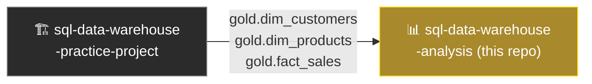

# 📊 SQL Data Analytics Project

<p align="center">
  
  
  
</p>

<p align="center">
  Exploratory data analysis, advanced SQL analytics, and reporting views built on top of a custom SQL Server data warehouse.
</p>

---

## 📖 About

This project picks up where the data warehouse leaves off — taking the Gold-layer star schema and turning it into insight. It covers exploratory data analysis (EDA), deeper analytical patterns (trends, segmentation, ranking), and two reusable reporting views for products and customers.

## 📦 Data Source

This project builds on **[sql-data-warehouse-practice-project](https://github.com/DrVillain/sql-data-warehouse-practice-project)**, which implements the ETL pipeline and Gold-layer star schema used here:



## 🎯 Goals

- Explore the Gold layer to understand scope, structure, and data quality
- Apply advanced SQL analysis techniques: trends, cumulative metrics, YoY performance, segmentation
- Build reusable reporting views summarizing product and customer behavior
- Practice translating raw star-schema data into business-ready insight

## 🛠️ Tech Stack

- **SQL Server** — database engine
- **T-SQL** — analytical queries & views
- **SSMS** — development & query execution

## 📂 Repository Structure

```
sql-data-analytics-project/
│
├── scripts/
│   ├── exploratory/
│   │   └── dw_eda.sql   # Database, dimension, date range & key metric exploration
│   │
│   ├── analysis/
│   │   └── dw_ada.sql      # Trends, cumulative metrics, YoY performance, segmentation
│   │
│   └── reports/
│       ├── report_products.sql        # gold.report_products view
│       └── report_customers.sql       # gold.report_customers view
│
├── documents/                          # Notes & findings
│
├── LICENSE
└── README.md
```

## 🔍 What's Inside

### Exploratory Data Analysis
Initial pass over the Gold layer — database structure, dimension values, date ranges, and overall key metrics (total sales, orders, customers, products).

### Advanced Data Analysis
Deeper analytical patterns:
- **Change over time** — sales & customer trends by year/month
- **Cumulative analysis** — running totals and moving averages
- **Performance analysis** — year-over-year product performance vs. historical average
- **Part-to-whole** — category contribution to total revenue
- **Segmentation** — products by cost range, customers by spending tier (VIP / Regular / New)

### Reports
Two production-style reporting views:

| View | Description |
|------|-------------|
| `gold.report_products` | Per-product metrics: performance tier, total sales, orders, recency, avg order revenue, avg monthly revenue |
| `gold.report_customers` | Per-customer metrics: age group, customer tier (VIP/Regular/New), recency, avg order value, avg monthly spend |

## 🚀 Getting Started

1. Set up the data warehouse first by following **[sql-data-warehouse-practice-project](https://github.com/DrVillain/sql-data-warehouse-practice-project)**
2. Clone this repo
   ```bash
   git clone https://github.com/DrVillain/sql-data-warehouse-analysis.git
   ```
3. Run the scripts in `scripts/exploratory/` to explore the Gold layer
4. Run the scripts in `scripts/analysis/` for deeper analytical insight
5. Run the scripts in `scripts/reports/` to create the `gold.report_products` and `gold.report_customers` views

## 📄 License

This project is licensed under the terms of the [LICENSE](LICENSE) file included in this repo.
